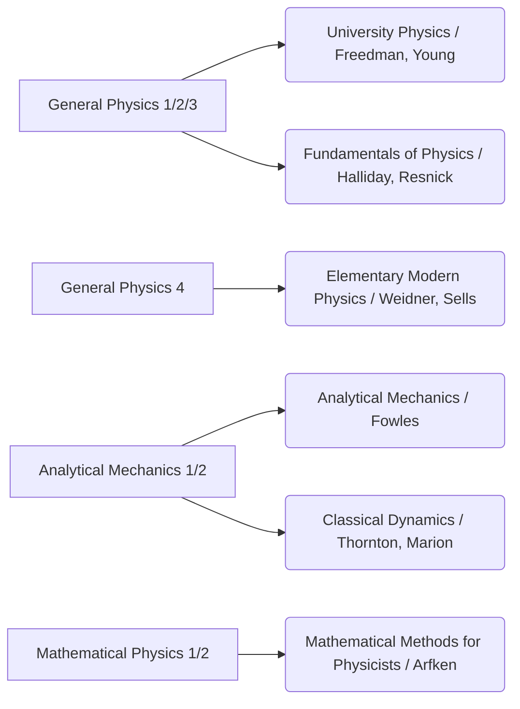

These days every topic in science (and in any other areas) has lots of books, but we can not read all of them.
So I decided to list the books in my library (digital or physical) which I've read.

<!-- 
- Subjects' name syntax
    subject_name["and this is complete name"]
- Subjects' references syntax
    subjectName_referenceName_author("complete name / author")
 -->

